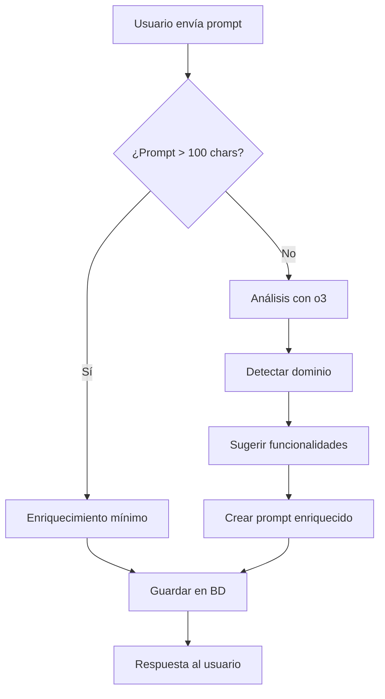

# 🤖 Guía del Sistema de Enriquecimiento de Prompts

## 📋 Nuevo Endpoint: `POST /mobile-generator/from-prompt`

El sistema ahora incluye un **endpoint especializado** para crear aplicaciones móviles desde descripciones de texto, con **enriquecimiento automático** usando IA.

## 🚀 Características

### ✅ **Enriquecimiento Automático**
- Detecta el dominio de la aplicación (finanzas, educación, salud, etc.)
- Agrega funcionalidades base obligatorias
- Sugiere funcionalidades específicas del dominio
- Usa o3 para análisis inteligente

### ✅ **Funcionalidades Base Automáticas**
Toda app generada incluye automáticamente:
- Sistema de autenticación completo
- Dashboard/Home principal
- Perfil de usuario editable
- Configuraciones de la aplicación
- Navegación con drawer
- Estados de carga y error
- Validaciones de formularios

## 📊 Comparación de Endpoints

| Característica | `POST /mobile-generator` | `POST /mobile-generator/from-prompt` |
|----------------|--------------------------|-------------------------------------|
| **Entrada** | XML, mockup_id, prompt opcional | Solo prompt (requerido) |
| **Procesamiento** | Análisis de XML específico | Enriquecimiento automático con IA |
| **Salida** | App basada en mockup visual | App completa desde descripción |
| **Uso** | Frontend visual → App | Descripción texto → App |

## 🔧 Ejemplos de Uso

### **Ejemplo 1: Prompt Básico**
```bash
curl -X POST http://localhost:3000/mobile-generator/from-prompt \
  -H "Authorization: Bearer tu-jwt" \
  -H "Content-Type: application/json" \
  -d '{
    "prompt": "crea una app móvil de gestión contable"
  }'
```

**Lo que hace internamente:**
1. Detecta dominio: "finanzas/contable"
2. Agrega funcionalidades base
3. Enriquece con: formularios de transacciones, reportes, categorización, etc.
4. Genera prompt completo para o3

### **Ejemplo 2: Prompt Detallado**
```bash
curl -X POST http://localhost:3000/mobile-generator/from-prompt \
  -H "Authorization: Bearer tu-jwt" \
  -H "Content-Type: application/json" \
  -d '{
    "prompt": "crea una aplicación móvil de gestión contable con login, formularios de transacciones, reportes financieros, dashboard con gráficos y categorización de gastos",
    "nombre": "ContaApp Pro",
    "project_type": "flutter",
    "config": {
      "package_name": "com.empresa.contaapp",
      "version": "1.0.0",
      "features": ["auth", "reports", "graphs"]
    }
  }'
```

**Lo que hace internamente:**
1. Detecta que ya es detallado (>100 caracteres)
2. Solo agrega funcionalidades base mínimas
3. Respeta las especificaciones del usuario

### **Ejemplo 3: Otros Dominios**
```json
{
  "prompt": "crea una app de delivery de comida"
}
```
**Enriquecimiento automático:**
- Catálogo de restaurantes
- Carrito de compras
- Tracking de pedidos
- Métodos de pago
- Rating y reviews

```json
{
  "prompt": "crea una app de citas médicas"
}
```
**Enriquecimiento automático:**
- Agenda de doctores
- Reserva de citas
- Historial médico
- Recordatorios
- Telemedicina

## 🧠 Proceso de Enriquecimiento

### **Flujo Detallado:**


### **Ejemplo de Transformación:**
```
ENTRADA:
"crea una app móvil de gestión contable"

SALIDA ENRIQUECIDA:
"crea una app móvil de gestión contable con las siguientes funcionalidades específicas:

FUNCIONALIDADES BASE:
- Sistema de autenticación completo (login, registro, logout)
- Dashboard principal con navegación intuitiva
- Perfil de usuario editable con configuraciones
- [...]

FUNCIONALIDADES ESPECÍFICAS DEL DOMINIO:
- Formularios de registro de transacciones (ingresos/gastos)
- Categorización automática de movimientos financieros
- Dashboard con gráficos de flujo de dinero
- Reportes de balance mensual y anual
- [...]

PANTALLAS MÍNIMAS REQUERIDAS:
- LoginScreen, HomeScreen, TransactionsScreen, ReportsScreen, ProfileScreen"
```

## 🎯 Dominios Soportados

El sistema detecta automáticamente estos dominios:

| Dominio | Palabras Clave | Funcionalidades Agregadas |
|---------|----------------|---------------------------|
| **Finanzas** | contable, financiero, banco, dinero | Transacciones, reportes, gráficos |
| **Educación** | escolar, estudiante, profesor, curso | Gestión estudiantes, notas, calendario |
| **Salud** | médico, hospital, paciente, cita | Citas, historial, recordatorios |
| **Comercio** | tienda, venta, producto, carrito | Catálogo, compras, inventario |
| **Delivery** | delivery, entrega, pedido, restaurante | Tracking, menús, pagos |
| **Social** | chat, mensaje, amigo, red social | Mensajería, posts, perfil social |

## ⚡ Ventajas del Nuevo Sistema

### **Para Desarrolladores:**
- ✅ **Menos trabajo**: No necesitan especificar cada funcionalidad
- ✅ **Apps completas**: Siempre genera funcionalidades mínimas
- ✅ **Especialización**: Funcionalidades específicas por dominio
- ✅ **Consistencia**: Arquitectura estándar en todas las apps

### **Para Usuarios Finales:**
- ✅ **Fácil de usar**: Solo describir qué quieren
- ✅ **Apps robustas**: Funcionalidades profesionales automáticas
- ✅ **Rápido**: Generación inteligente sin configuración manual

## 🔒 Compatibilidad

### **✅ NO Afecta Funcionalidad Existente:**
- `POST /mobile-generator` (XML/mockups) funciona igual
- `POST /mobile-generator/:id/generate` funciona igual
- Todos los endpoints CRUD funcionan igual

### **✅ Ambos Tipos Generan Igual:**
- Mismo proceso de generación de código
- Mismo archivo ZIP de salida
- Misma calidad de aplicación Flutter

## 🚀 Próximos Pasos

1. **Probar el nuevo endpoint** con diferentes tipos de prompts
2. **Comparar resultados** entre prompts básicos y detallados
3. **Feedback** para mejorar el sistema de enriquecimiento
4. **Agregar más dominios** según las necesidades

## 📞 Soporte

Si tienes dudas o encuentras problemas:
- Revisar logs del servidor para el proceso de enriquecimiento
- Probar con prompts más o menos detallados
- Verificar que la API key de OpenAI esté configurada correctamente 